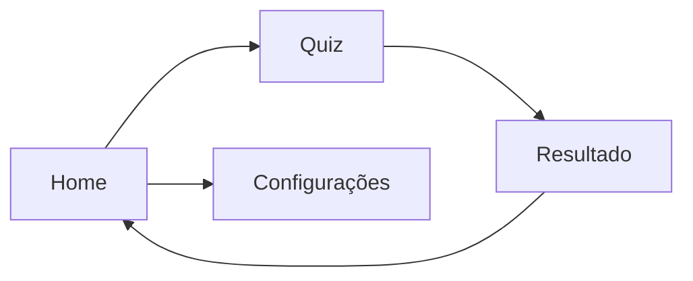
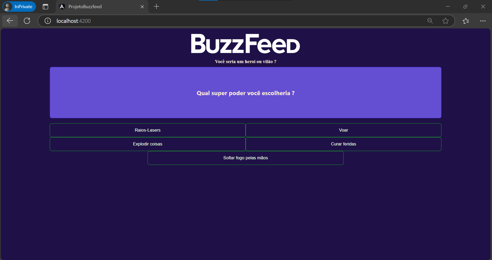
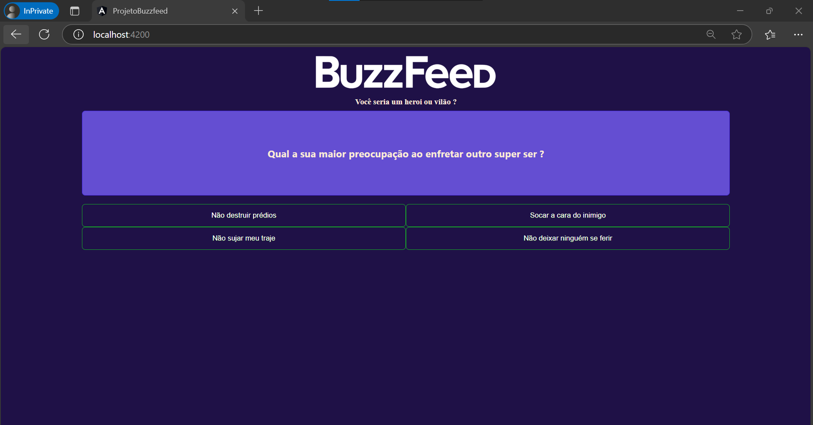
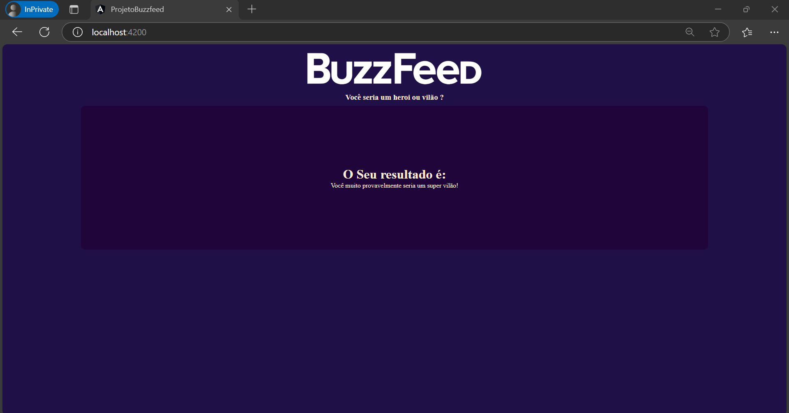
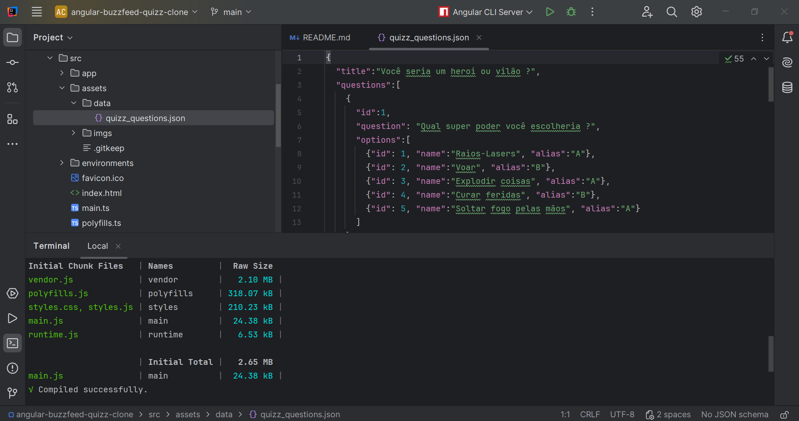

# Criando um Clone do BuzzFeed com Angular

<h1 align="center">
    
</h1>

## Descrição do Projeto

Neste projeto, desenvolvi uma aplicação interativa no estilo BuzzFeed, com quizzes e resultados dinâmicos, utilizando o **Angular**. O objetivo foi criar uma plataforma de quizzes, onde os usuários podem participar e ver os resultados de maneira divertida e interativa.

A aplicação foi construída utilizando as melhores práticas do Angular, com foco na experiência do usuário e na organização do código.

A principal funcionalidade do sistema é permitir aos usuários responderem a quizzes e verem os resultados ao final. A interface foi projetada para ser intuitiva e responsiva, garantindo uma boa experiência de navegação tanto em dispositivos móveis quanto em desktop.

## ⛏️ Tecnologias utilizadas (Pré-requisitos):

- **Angular 14**
- **HTML5**
- **CSS3**
- **TypeScript**
- **Bootstrap 5**
- **Angular CLI**
- **Karma** (Testes unitários)

## Estrutura do Projeto

O projeto é organizado em várias pastas, cada uma com uma função específica:

- **app**: Contém os componentes principais da aplicação, como quiz, resultados e navegação.
- **assets**: Armazena as imagens e arquivos estáticos.
- **services**: Contém serviços para manipulação de dados e integração com outras partes do sistema.
- **models**: Contém as interfaces e classes para os dados dos quizzes e resultados.

### Funcionalidades Implementadas:

- **Criação e Exibição de Quizzes**: Permite criar quizzes interativos com múltiplas questões e respostas.
- **Exibição de Resultados**: Após a conclusão do quiz, o sistema exibe os resultados do usuário.
- **Navegação entre Páginas**: Utilização do Angular Routing para navegação entre a página inicial, quizzes e resultados.
- **Estilo Responsivo**: A interface é responsiva, garantindo uma boa visualização em dispositivos móveis e desktop.

## Figma para Abstração de Domínio

O Figma foi utilizado para a abstração do domínio deste projeto, auxiliando na definição da estrutura das páginas e nos fluxos de navegação da aplicação.

### Diagrama de Componentes

Abaixo está o diagrama que ilustra a estrutura do sistema, com os principais componentes e suas interações.



### Capturas de Tela da Execução do Projeto
Aqui estão algumas capturas de tela que ilustram o funcionamento da aplicação:

### Tela 1: Página inicial com lista de quizzes disponíveis

<h1 align="center">  </h1>

### Tela 2: Quiz em execução com perguntas e respostas
<h1 align="center">  </h1>

### Tela 3: Exibição do resultado do quiz
<h1 align="center">  </h1>

### Tela 3: Execução de testes
<h1 align="center">  </h1>

⚙️ Como Rodar o Projeto Localmente: 

## Instalação
### 1. Clone este repositório:
```
git clone https://github.com/viniciosmucheirone/DIO-Blog-Angular.git
```
### 2. Navegue até o diretório do projeto:

```
cd DIO-Blog-Angular
```
### 3. Instale as dependências do projeto:
```
npm install
```
### 4. Execute o servidor de desenvolvimento:
```
ng serve
```

Agora, acesse a aplicação em http://localhost:4200/. A aplicação será recarregada automaticamente sempre que houver alterações nos arquivos de origem.

## Conclusão
Este projeto foi uma ótima oportunidade para explorar o Angular e aprimorar habilidades em desenvolvimento de aplicações web interativas. Criar uma plataforma de quizzes com uma interface dinâmica e responsiva me permitiu praticar a utilização de componentes, serviços e o gerenciamento de estado dentro do Angular.

Ao longo do desenvolvimento, foi possível integrar várias funcionalidades, como a navegação entre páginas, exibição de resultados e interação com o usuário de forma fluida e agradável. Além disso, a aplicação segue as melhores práticas de desenvolvimento em Angular, o que ajuda na escalabilidade e manutenibilidade do projeto.